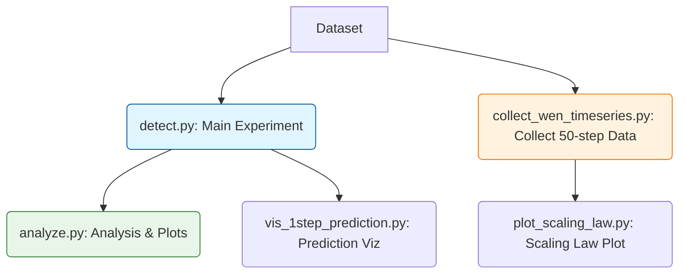

# Early Detection of Memorization in Diffusion Models

Official implementation (ICML 2026).

## 📋 Overview
Our key contributions include:

- **Metric 2 (Decoupled Metric)**: A novel curvature-based metric achieving **97.59% AUC** on SD 1.5
- **DSM (Dynamical Singularity Metric)**: Tracks score dynamics across denoising steps
- **Comprehensive Evaluation**: Tested on N=500 memorized + 500 non-memorized prompts

## 🎯 Main Results (N=500+500)

| Method | AUC | TPR @ 1% FPR |
|--------|-----|--------------|
| **Metric 2 (Ours)** | **0.9759** | 82.8% |
| **DSM (Step 1→2)** | **0.9745** | **85.8%** |
| DSM (Step 0→1) | 0.9647 | 83.4% |
| Jeon et al. | 0.9642 | 80.6% |
| Wen et al. (Step 1) | 0.9621 | 79.0% |

**Model**: Stable Diffusion 1.5  
**Evaluation**: 500 memorized + 500 non-memorized prompts


### Quick Demo (3 minutes)

Test the code with included sample data (10 samples):

```bash
# 1. Run detection
python detect.py \
    --model_id "runwayml/stable-diffusion-v1-5" \
    --mem_dataset "data/memorized_prompts_sample.jsonl" \
    --nonmem_dataset "data/non_memorized_prompts_sample.jsonl" \
    --output_dir "results/demo/"

# 2. Analyze results
python analyze.py \
    --results_dir "results/demo/" \
    --plot_roc \
    --plot_distributions
```

## 🔄 Standard Workflow

The repository is organized into three stages:



### 1️⃣ Main Experiment (Core Detection)
Calculate all detection metrics (Metric 2, DSM, Wen, Jeon).

```bash
python detect.py \
    --model_id "runwayml/stable-diffusion-v1-5" \
    --mem_dataset "path/to/memorized_500.jsonl" \
    --nonmem_dataset "path/to/non_memorized_500.jsonl" \
    --output_dir "results/paper_results/"
```


### 2️⃣ Analysis (Results & Plots)
Generate AUC tables, ROC curves, and score distributions.

```bash
python analyze.py --results_dir "results/paper_results/" --plot_roc --plot_distributions
```

### 3️⃣ Paper Visualization (Optional)
Generate specific figures for the paper.

#### A. Prediction Visualization (Figure 1/2)
Directly uses main experiment output.
```bash
python vis_1step_prediction.py \
    --mem_results "results/paper_results/memorized_results.jsonl" \
    --nonmem_results "results/paper_results/non_memorized_results.jsonl"
```

#### B. Scaling Law Plot (Figure 3)
Requires separate data collection for all 50 timesteps.
```bash
python collect_wen_timeseries.py \
    --mem_dataset "path/to/memorized.jsonl" \
    --nonmem_dataset "path/to/non_memorized.jsonl" \
    --limit 500

# 2. Plot
python plot_scaling_law.py
```

## 📦 Repository Structure

```
diffusion-memorization-detection/
├── detect.py                    # Main detection script
├── analyze.py                   # Result analysis script
├── test_installation.py         # Installation verification
│
├── vis_1step_prediction.py      # Visualization script (Step 1 prediction)
├── collect_wen_timeseries.py    # Data collection for Scaling Law
├── plot_scaling_law.py          # Plotting script for Scaling Law
│
├── requirements.txt             # Python dependencies
├── README.md                    # This file
│
├── data/
│   ├── memorized_prompts_sample.jsonl     # Example memorized prompts
│   └── non_memorized_prompts_sample.jsonl # Example non-memorized prompts
│
├── src/
│   ├── detect_all_metrics.py    # Core metric implementations (6 metrics)
│   └── analysis_utils.py        # Analysis and plotting utilities
│
└── results/
    └── .gitkeep                 # Output directory
```


